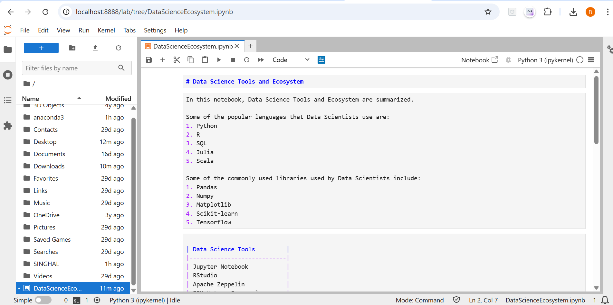

# datascience-final-assignment

# Data Science Tools and Ecosystem

This repository contains the final assignment for the *"Tools for Data Science"* course on Coursera, offered by IBM. The notebook summarizes key tools, libraries, and concepts every data science professional should know.

## 📘 Notebook Contents

The notebook DataScienceEcosystem.ipynb includes:

- A title and introduction to the Data Science ecosystem
- Popular programming languages used in data science
- Commonly used libraries like Pandas, NumPy, and Matplotlib
- Open-source development tools (e.g., Jupyter Notebook, RStudio)
- Simple Python code to convert minutes into hours
- Author and objectives section

## 🖼 Preview

## 🔗 Course Info

- *Course*: Tools for Data Science  
- *Platform*: Coursera (IBM Data Science Certificate)
- *Module*: Final Assignment (Module 6)

## 🧑‍💻 Author

*Rishabh Singhal*

## 🔗 How to View

You can open and view the notebook in any Jupyter-compatible environment like:
- Jupyter Notebook
- JupyterLab
- JupyterLite (online, no installation needed)
